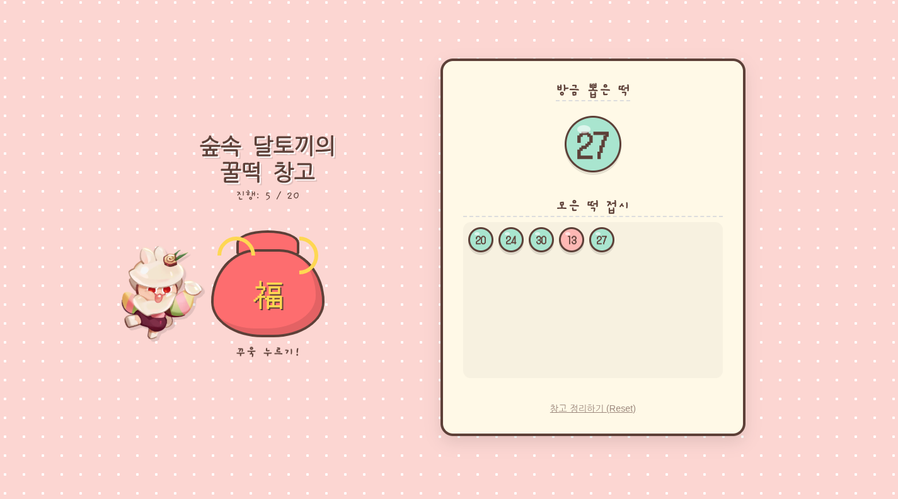

# 🐰 Streams (스트림스) - Digital Moderator



오프라인 보드게임 '스트림스(Streams)'를 진행할 때, **타일을 뽑아주는 웹 애플리케이션**입니다.<br>
귀여운 달토끼맛 쿠키와 함께 즐거운 게임을 즐겨보세요! 😆

- 해당 게임을 진행하려면 streams 보드게임(행복한 바오밥) 또는 워크시트가 필요합니다.
- 행복한 바오밥의 소중한 출판물이므로, 게임이 즐거우셨다면 보드게임을 구입해서 사용해주세요.(저는 출판사와 무관한 사람입니다..)

🔗 **구매처**: [행복한 바오밥](https://www.happybaobab.com/shop/item.php?it_id=BC08C-20901)

🔗 **워크시트**: [행복한 바오밥 제공](https://www.happybaobab.com/34/56?amp;page=3)

🔗 **Demo**: [https://erdoslibrary.github.io/streams/](https://erdoslibrary.github.io/streams/)

---
## 🧧 제작 배경 (Background)

설날 맞이 단체 이벤트를 위해 제작된 웹 APP. <br>
\#꿀떡 \#명절을핑계삼아단체게임 \#노는게제일좋아


> **Note**: 본 프로젝트에 사용된 메인 캐릭터 이미지는 데브시스터즈(Devsisters)의 [쿠키런: 킹덤 - 달토끼맛 쿠키](https://namu.wiki/w/%EB%8B%AC%ED%86%A0%EB%81%BC%EB%A7%9B%20%EC%BF%A0%ED%82%A4)를 활용하였습니다. 

<br/>

<div align="right">

**Project by borlee** _Developed with Antigravity_

</div>

---

## 🎲 스트림스 소개 (About Streams)

스트림스는 무작위로 나오는 숫자를 오름차순으로 길게 연결하여 가장 길게 연결한 사람이 승리하는 "오름차순 빙고게임"입니다.

### 1. 기본 진행
- 총 **20턴** 동안 진행됩니다.
- 플레이어는 매 턴마다 뽑힌 숫자를 자신의 워크시트에 기록합니다.
- 적은 숫자의 위치는 절대 바꿀 수 없습니다.
- **오름차순**으로 연결된 길이가 길수록 높은 점수를 받습니다.

### 2. 타일 구성 (Tile Composition)
총 40개의 타일이 주머니에 들어있으며, 확률은 다음과 같습니다.

| 숫자 (Value) | 개수 (Count) | 비고 |
| :---: | :---: | :--- |
| **1 ~ 10** | 각 1개 | 낮은 숫자 |
| **11 ~ 19** | 각 2개 | **가장 나올 확률이 높음** (전략적 핵심) |
| **20 ~ 30** | 각 1개 | 높은 숫자 |
| **★ (조커)** | 1개 | 원하는 숫자로 대체 가능 |

(총 40개: 10 + 18 + 11 + 1)

---

## ✨ APP 주요 기능 (Features)

- **귀여운 인터랙션**: 주머니를 누르면 쫀득한 애니메이션과 함께 토끼가 반응합니다.
- **실감나는 사운드**: 타일을 뽑을 때의 '뽕!' 소리와 게임 종료 시의 팡파레 효과.
- **히스토리(History)**: 지금까지 나온 숫자를 한눈에 볼 수 있는 그리드 제공.
- **자동 진행 관리**: 남은 타일 수와 현재 턴(20턴 제한)을 자동으로 계산하여 알려줍니다.

---

## 🎮 플레이 방법 (How to Play)

1. 위 **데모 링크**에 접속합니다.
2. **복주머니**를 클릭합니다.
3. 숫자가 나오면 워크 시트에 적습니다.
4. 20개의 숫자를 모두 뽑으면 게임이 종료됩니다.
5. 워크 시트를 참고해서 각자의 점수를 계산합니다.


---

## 🛠️ 로컬 실행 (Installation)

별도의 서버 설치 없이, 브라우저만 있으면 실행 가능합니다.

1. 저장소를 클론하거나 다운로드합니다.
   ```bash
   git clone https://github.com/erdoslibrary/streams.git
   ```
2. `index.html` 파일을 웹 브라우저(Chrome, Safari 등)로 엽니다.
